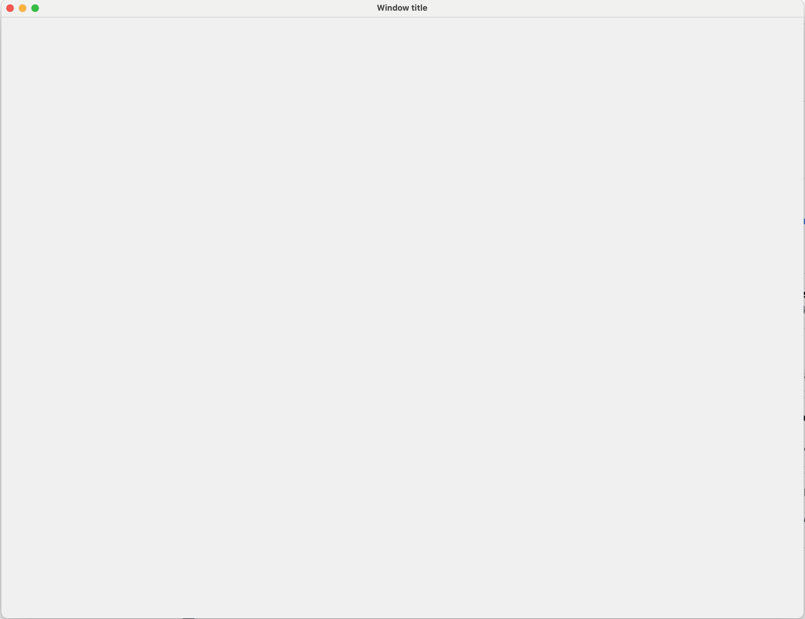

# AZBasic

This is the simplest demo code, and is really intended as a starting template to show how to go about creating code. It's also what I typically start from when creating a new app

The entirety of AppDelegate.m is:
```
//
//  AppDelegate.m
//  AZBasic
//
//  Created by ThrudTheBarbarian for Azoth.
//

#import "AppDelegate.h"

/*****************************************************************************\
|* "Private" properties
\*****************************************************************************/
@interface AppDelegate ()
@end

@implementation AppDelegate

/*****************************************************************************\
|* Application is ready to go
\*****************************************************************************/
- (void)applicationDidFinishLaunching:(NSNotification *)aNotification
	{
	// Insert code here to initialize your application
	}


/*****************************************************************************\
|* User wants to quit
\*****************************************************************************/
- (void)applicationWillTerminate:(NSNotification *)aNotification
	{
	// Insert code here to tear down your application
	}


@end
```

... which ought to look pretty familiar to someone coming from AppKit...

It produces the expected result 


